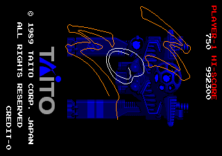

# Master of Weapon — Analogue Pocket core (openFPGA)

Master of Weapon (Taito, 1989) on Taito B System hardware, for the Analogue
Pocket via openFPGA.

The whole board is in gateware: the 68000, the Z80 sound board with its
YM2203, and the TC0180VCU that draws the two 16×16 tilemaps, the text layer
and the sprites — including the sprite framebuffer the chip paints into during
vblank, which is what draws the game's hand-written title.

> **ROMs are not included and never will be.** You supply your own MAME
> `masterw` romset; the core reads one image built from it.

| board part | implementation | verified by |
|---|---|---|
| 68000 @ 12 MHz | fx68k (cycle-accurate) | system benches, hardware |
| Z80 @ 6 MHz | tv80 | system bench |
| YM2203 @ 3 MHz | jotego's jt03 | within 6% of MAME's own recording across the music's bands (`sim/run_sound.sh`) |
| TC0180VCU | `rtl/tc0180vcu.sv` and the three engines beside it | **pixel-identical to MAME** on nine frozen states (`sim/run_video.sh`) |
| TC0040IOC | `rtl/tc0040ioc.sv` | — |
| PC060HA | `rtl/pc060ha.sv`, a literal translation of MAME's | system bench |
| 1.6 MB ROM | Pocket SDRAM (`target/pocket/masterw_mem.sv`) | image byte-identical to MAME's regions (`tools/verify_rom.py`) |
| 64 KB tilemap VRAM | Pocket SRAM | self-test at reset, passed on hardware |

`docs/hardware.md` describes the board, `docs/core-design.md` the mapping onto
the Pocket, and `METHODOLOGY.md` the method: MAME is the oracle, a Python
reference renderer is the executable spec, and frozen-state benches are the
regression gate.

## Status

**v0.1.0 runs on a Pocket**: it boots, plays, and the service-mode crosshatch
is clean.  What is proven, and how:

* **The ROM image is exactly what MAME loads.** `tools/verify_rom.py`
  de-interleaves the built image and compares all three regions with the bytes
  MAME hands to the chips: identical.
* **The video is pixel-identical to MAME.** `tools/vcu_model.py` is a model of
  the TC0180VCU written from MAME's device, checked frame by frame against
  MAME's own output; `sim/run_video.sh` then loads the same frozen states into
  the RTL and diffs the palette indices the hardware produced against the
  model's. Nine frames spanning boot, attract, gameplay and the title screen
  match exactly, with zero differing indices.
* **The machine boots against the Pocket's real memory glue.**
  `sim/run_pocket.sh` runs both CPUs on the real program through
  `masterw_mem`, the SDRAM controller and the SRAM port, with behavioural
  chips beyond the pins and the image sent through the download port at the
  Pocket loader's rate. `sim/run_system.sh` is the faster bench with ideal
  memories.
* **The sound plays MAME's music.** `sim/run_sound.sh` replays the 68000's own
  CIU traffic, recorded from MAME, into the core's Z80 and YM2203 and compares
  eight seconds with MAME's recording: within 6% in the two bands the music
  occupies (`artifacts/audio/comparison.txt`). The SSG's level against the FM
  is still unmeasured, because the passage compared plays no SSG.
* **Timing closes.** Quartus 18.1 reports no negative slack in any corner, and
  CI refuses a build that does -- or one whose constraints silently matched
  nothing.

What the first hardware runs found, none of which a bench had shown:

* **A black screen.** The Pocket's loader sends a byte every eight clocks and
  cannot be told to wait; the download path kept one pending word, and a word
  waiting behind an SDRAM refresh had its high byte overwritten by the next.
  The ROM came out peppered with bad words and the 68000 crashed within
  frames. The Cadash core had met and fixed the same fault; the fix is a FIFO.
  `sim/run_pocket.sh` exists because of it, and reproduces it.
* **A striped picture.** The two line buffers were a 2 x 320 array of flops,
  and on the panel one of them lost writes in three 32-pixel blocks of the
  line. They are one block RAM now. Why the fitted array misbehaved with
  timing analysis clean is not proven.
* **The menu rebooted the game.** The Pocket's menu-open signal was ORed into
  reset. It now pauses the CPUs and the sound chip and leaves the picture up.

Not implemented: the TC0180VCU's screen flip (video control bit 4), so the
Cabinet and Flip Screen DIP switches are not offered. The bring-up diagnostics
(an on-screen status panel, an SRAM self-test at reset, a first-fault capture
for the 68000, and SDRAM/SRAM timing fallbacks) are still in the gateware but
off the menu.

<p align="center">
  <br>
  <em>The title screen as the RTL draws it. The signature is a single sprite
  moving along the stroke, accumulating in a framebuffer the chip is told not
  to clear — 500 frames of it, and the core lands on MAME's frame exactly.</em>
</p>

## Building the ROM image

```sh
python3 mra_build.py masterw.mra masterw.zip
```

The builder needs nothing but Python 3. It reads the MAME zip (or a directory
of loose files) directly, checks every ROM's CRC32, and verifies the finished
1,638,400-byte image against a known md5, so a wrong or damaged romset is
reported rather than quietly built into something that half works.

Copy the result to `Assets/masterw/common/masterw.rom` on the Pocket's SD
card. Already using `pupdate` or the standard `mra` tool? Point it at
`masterw.mra`; it is an ordinary MRA file.

## Building the core

`./build-local.sh` compiles with Quartus 18.1 in Docker and leaves the SD-card
package in `release/pocket/`. `./build-local.sh map` runs analysis and
synthesis only, which takes a couple of minutes and catches what Verilator
cannot — run it before every push, because a broken push costs a whole CI
cycle. Every push to `main` compiles in CI and uploads the package as the
`masterw-pocket` artifact.

## Checking it

```sh
tools/regress_render.sh     # the model against MAME, pixel for pixel
sim/run_video.sh            # the RTL against the model, index for index
sim/run_system.sh           # the whole machine, both CPUs, real program
sim/lint.sh                 # every module on its own
```

The first run of `tools/regress_render.sh` captures the frozen states from
MAME, which needs a `masterw` romset in `masterw/` and MAME on the path.
MAME will not start the set without three PAL dumps that no emulation reads,
so `tools/shadow_romset.sh` builds a symlink farm with placeholders rather
than touching your romset.

## Credits

* MAME, for the driver and device models this was written against —
  `ref/mame/` holds the exact files, fetched verbatim.
* Jorge Cwik's fx68k, Guy Hutchison's tv80, and Jose Tejada's jt03 and jt49;
  see `modules/VENDOR.md`.
* The openFPGA/opengateware framework in `platform/pocket/`.
* Guru, for the board photograph and the measurements in `docs/hardware.md`.
